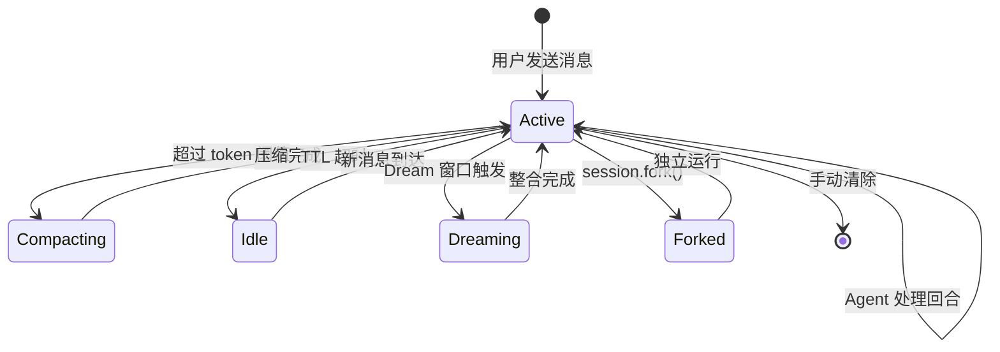

# nanobot 系统架构

## 概述

nanobot 是一个轻量级开源 AI Agent 框架，使用 Python 3.11+ 编写核心引擎，React/TypeScript 构建 WebUI。它围绕一个异步 Agent 循环（AgentLoop）构建，从多个聊天渠道接收消息、调用 LLM 提供商、执行工具并管理会话记忆。系统通过 `MessageBus` 实现渠道和 Agent 的解耦，支持 17 种聊天平台（Telegram、Discord、Slack、微信、飞书、钉钉、WhatsApp 等），并提供了 OpenAI 兼容的 HTTP API 和 Python SDK 供外部调用。

架构以文件系统为持久化基础——所有记忆（MEMORY.md, SOUL.md, USER.md）、会话历史和配置均以 JSON/Markdown 文件存储，使用原子写入和 fsync 确保数据安全。Dream 两阶段记忆整合系统允许 Agent 在"睡眠"时反思对话并更新长期记忆。

## 技术栈

**语言与运行时**
- Python 3.11+
- TypeScript（WebUI）
- Node.js 24（WebUI 构建）

**框架**
- Typer（CLI）
- aiohttp（HTTP API Server）
- React 18 + Vite 5（WebUI）
- prompt_toolkit + Rich（交互式 REPL）
- Pydantic v2（配置和数据模型）
- pytest + pytest-asyncio（测试）

**LLM 提供商**
- Anthropic Claude API
- OpenAI 兼容 API（含 Azure, Bedrock, GitHub Copilot, xAI Grok, OpenAI Codex）
- 自动回退（FallbackProvider）

**WebUI 组件**
- Radix UI（对话框、下拉菜单、提示框）
- Tailwind CSS 3（样式）
- streamdown（流式 Markdown 渲染）
- i18next（多语言）
- Vitest + Testing Library（测试）

**消息与通信**
- asyncio（异步核心）
- websockets（Python WebSocket）
- WebSocket（浏览器客户端）

**持久化**
- 文件系统（JSONL + Markdown）
- GitStore（版本化持久化）
- 原子写入 + fsync

**外部工具**
- DuckDuckGo（Web 搜索）
- MCP（Model Context Protocol）
- readabiliy-lxml（网页可读性提取）
- pypdf, python-docx, openpyxl, python-pptx（文档解析）

## 项目结构

```
workspace/
├── nanobot/                   # Python 核心包
│   ├── __init__.py            # 版本解析，惰性导出
│   ├── __main__.py            # python -m nanobot 入口
│   ├── nanobot.py             # Nanobot 类：高级编程 facade
│   ├── agent/                 # Agent 核心引擎
│   │   ├── loop.py            # AgentLoop：核心消息处理循环
│   │   ├── runner.py          # AgentRunner：多轮 LLM 对话执行
│   │   ├── memory.py          # MemoryStore + Consolidator
│   │   ├── context.py         # ContextBuilder：上下文构建
│   │   ├── autocompact.py     # 自动上下文压缩
│   │   ├── subagent.py        # SubagentManager：子 Agent
│   │   ├── tools/             # Agent 工具集（20+ 工具）
│   │   │   ├── registry.py    # ToolRegistry：工具注册和执行
│   │   │   ├── filesystem.py  # 文件系统操作
│   │   │   ├── shell.py       # Shell 执行（含沙箱）
│   │   │   ├── search.py      # Web 搜索
│   │   │   ├── web.py         # Web 抓取
│   │   │   ├── mcp.py         # MCP 服务器工具
│   │   │   ├── cron.py        # 定时任务
│   │   │   ├── long_task.py   # 长期任务
│   │   │   └── ...            # 其他工具
│   │   ├── hook.py            # Agent 生命周期钩子
│   │   ├── hooks/             # 具体钩子实现
│   │   ├── model_presets.py   # 模型预设
│   │   ├── model_runtime.py   # 模型运行时解析
│   │   ├── skills.py          # 技能加载器
│   │   ├── cron_turns.py      # Cron 回合协调
│   │   ├── automation_turns.py# 自动化回合调度
│   │   └── turn_delivery.py   # 回合投递
│   ├── providers/             # LLM 提供商
│   │   ├── base.py            # LLMProvider ABC
│   │   ├── anthropic_provider.py
│   │   ├── openai_compat_provider.py
│   │   ├── azure_openai_provider.py
│   │   ├── bedrock_provider.py
│   │   ├── github_copilot_provider.py
│   │   ├── openai_codex_provider.py
│   │   ├── xai_grok_provider.py
│   │   ├── fallback_provider.py
│   │   ├── factory.py         # ProviderSnapshot 工厂
│   │   ├── registry.py        # 提供商注册表和模型发现
│   │   ├── image_generation.py# 图像生成配置
│   │   └── transcription.py   # 音频转录
│   ├── channels/              # 聊天渠道集成（17 个渠道）
│   │   ├── base.py            # BaseChannel ABC
│   │   ├── manager.py         # ChannelManager 生命周期管理
│   │   ├── registry.py        # 渠道注册表
│   │   ├── telegram/
│   │   ├── discord/
│   │   ├── slack/
│   │   ├── weixin/            # 微信
│   │   ├── feishu/            # 飞书
│   │   ├── dingtalk/          # 钉钉
│   │   ├── whatsapp/
│   │   ├── websocket/         # WebSocket 直连
│   │   └── ...
│   ├── session/               # 会话管理
│   │   ├── manager.py         # Session/SessionManager
│   │   ├── keys.py            # 统一会话键
│   │   ├── goal_state.py      # 持续性目标状态
│   │   └── ...
│   ├── config/                # 配置系统
│   │   ├── schema.py          # Pydantic 配置模型
│   │   ├── loader.py          # 加载/保存/迁移
│   │   ├── paths.py           # 路径辅助
│   │   └── watcher.py         # 配置热重载
│   ├── bus/                   # 消息总线
│   │   ├── queue.py           # MessageBus（核心解耦）
│   │   ├── events.py          # 事件数据模型
│   │   └── runtime_events.py  # RuntimeEventBus
│   ├── cli/                   # CLI
│   │   ├── commands.py        # 主 CLI（3014行）
│   │   ├── gateway.py         # Gateway 子命令
│   │   ├── stream.py          # 流式渲染器
│   │   ├── models.py          # 模型命令
│   │   └── onboard.py         # 入门向导
│   ├── webui/                 # WebUI Python 后端
│   │   ├── server.py          # WS 协议、媒体网关
│   │   ├── settings_api.py    # 设置 API
│   │   ├── skills_api.py      # 技能 API
│   │   ├── workspace_api.py   # 工作区 API
│   │   └── session_api.py     # 会话列表 API
│   ├── api/                   # HTTP API
│   │   ├── server.py          # OpenAI 兼容 API（aiohttp）
│   │   └── runtime.py         # API 运行时
│   ├── gateway/               # 网关管理
│   │   ├── runtime.py         # GatewayRuntime
│   │   └── service.py         # 系统服务安装
│   ├── command/               # 命令路由
│   │   ├── router.py          # CommandRouter
│   │   └── builtin.py         # 内置命令
│   ├── cron/                  # Cron 服务
│   │   └── service.py         # CronService
│   ├── triggers/              # 本地触发器
│   │   └── local_store.py     # LocalTriggerStore
│   ├── security/              # 安全
│   │   ├── workspace_access.py# 工作区访问控制
│   │   └── network.py         # 网络安全
│   ├── skills/                # 内置技能（12 个子目录）
│   ├── templates/             # Jinja2 提示模板
│   ├── sdk/                   # Python SDK
│   │   ├── runtime.py         # Nanobot 运行时
│   │   ├── clients.py         # Session/Memory/Runtime 客户端
│   │   └── streaming.py       # 流式事件
│   └── utils/                 # 工具辅助库（22 个文件）
├── webui/                     # React/TypeScript WebUI
│   ├── src/
│   │   ├── App.tsx            # 主应用组件
│   │   ├── main.tsx           # 应用入口
│   │   ├── components/        # UI 组件（ChatList, MessageBubble 等）
│   │   ├── hooks/             # 自定义 Hook（useNanobotStream 等）
│   │   ├── lib/               # 核心库（nanobot-client, api, bootstrap）
│   │   ├── providers/         # React Context
│   │   └── i18n/              # 国际化
│   ├── vite.config.ts         # Vite 构建配置
│   └── package.json
├── tests/                     # Python 测试（16 个子目录）
├── pyproject.toml             # 项目元数据和依赖
├── Dockerfile                 # 多阶段 Docker 构建
├── docker-compose.yml         # Docker 编排
└── entrypoint.sh              # 容器入口脚本
```

**入口点**
- `nanobot/__main__.py` - `python -m nanobot` 入口
- `nanobot/cli/commands.py:app` - CLI 主程序
- `nanobot/nanobot.py:Nanobot` - 编程 facade
- `nanobot/agent/loop.py:AgentLoop` - Agent 核心引擎入口
- `webui/src/main.tsx` - WebUI 入口

## 子系统

### AgentLoop（核心引擎）
**目的**: 消费入站消息，构建对话上下文，协调 AgentRunner 执行 LLM 会话。
**位置**: `nanobot/agent/loop.py`
**关键文件**: `loop.py`, `runner.py`, `context.py`, `memory.py`
**依赖**: ToolRegistry, ProviderSnapshot, SessionManager, CommandRouter, SubagentManager, CronTurnCoordinator, MessageBus
**被依赖**: Nanobot facade, CLI, Gateway

### AgentRunner（对话执行器）
**目的**: 执行多轮 LLM 对话循环——发送消息到 LLM 提供商、接收工具调用、执行工具、流式输出响应。
**位置**: `nanobot/agent/runner.py`
**关键文件**: `runner.py`
**依赖**: LLMProvider, ToolRegistry, Session
**被依赖**: AgentLoop

### MessageBus（消息总线）
**目的**: 通过两个独立 asyncio.Queue（inbound/outbound）解耦聊天渠道和 Agent，实现异步消息发布/消费。
**位置**: `nanobot/bus/queue.py`
**关键文件**: `queue.py`, `events.py`, `outbound_events.py`
**依赖**: 无外部依赖
**被依赖**: AgentLoop, BaseChannel, ChannelManager

### Channels（聊天渠道）
**目的**: 集成 17 种聊天平台，将外部消息转换为 InboundMessage，将 OutboundMessage 发送回平台。
**位置**: `nanobot/channels/`
**关键文件**: `base.py`（BaseChannel）, `manager.py`（ChannelManager）, 各渠道 `runtime.py`
**依赖**: MessageBus, 各平台 SDK
**被依赖**: Gateway, CLI

### Providers（LLM 提供商）
**目的**: 统一的 LLM 调用抽象层，支持多种模型 API 的流式和非流式调用。
**位置**: `nanobot/providers/`
**关键文件**: `base.py`（LLMProvider）, `factory.py`（ProviderSnapshot）, `registry.py`（模型发现）
**依赖**: 各 LLM SDK（anthropic, openai, boto3 等）
**被依赖**: AgentRunner, CLI, SDK

### SessionManager（会话管理）
**目的**: 持久化和管理对话历史，支持 LRU 缓存、上下文压缩和会话分叉。
**位置**: `nanobot/session/manager.py`
**关键文件**: `manager.py`, `keys.py`, `goal_state.py`
**依赖**: 文件系统
**被依赖**: AgentLoop, Nanobot facade

### MemoryStore（记忆系统）
**目的**: 通过文件 I/O 管理 Agent 的长期记忆（MEMORY.md, SOUL.md, USER.md, history.jsonl）。Consolidator 在 Dream 阶段调用 LLM 反思对话并更新记忆。
**位置**: `nanobot/agent/memory.py`
**关键文件**: `memory.py`
**依赖**: GitStore, SessionManager
**被依赖**: AgentLoop

### WebUI（前端界面）
**目的**: 提供基于浏览器的聊天界面，支持 Markdown 渲染、文件上传、语音录制和设置管理。
**位置**: `webui/`
**关键文件**: `App.tsx`, `lib/nanobot-client.ts`, `vite.config.ts`
**依赖**: Gateway（WebSocket 和 REST API）
**被依赖**: 终端用户

### Gateway（网关服务）
**目的**: 将 AgentLoop、ChannelManager 和 HTTP/WS 服务整合为可管理的前后台进程，支持 systemd/launchd 系统服务。
**位置**: `nanobot/cli/commands.py:_run_gateway`, `nanobot/gateway/`
**关键文件**: `gateway/runtime.py`, `gateway/service.py`
**依赖**: AgentLoop, ChannelManager, WebUI Python 后端
**被依赖**: CLI, Docker

## 架构图

### 系统整体架构

```mermaid
flowchart LR
    subgraph External["外部"]
        WebBrowser["Web 浏览器"]
        ChatApps["聊天平台{"Telegram / Discord / Slack / 微信 / WhatsApp / ..."}"]
        APIClients["API 客户端"]
    end

    subgraph Gateway["Gateway 服务"]
        HTTPAPI["HTTP API /v1/*"]
        WSServer["WebSocket 服务"]
        WebUIBackend["WebUI 后端 API"]
    end

    subgraph Core["Agent 核心"]
        AgentLoop["AgentLoop"]
        AgentRunner["AgentRunner"]
        ToolRegistry["ToolRegistry"]
        ContextBuilder["ContextBuilder"]
        MemoryStore["MemoryStore"]
        SessionManager["SessionManager"]
        CommandRouter["CommandRouter"]
    end

    subgraph Bus["消息总线"]
        MessageBus["MessageBus"]
    end

    subgraph Channels["渠道层"]
        ChannelManager["ChannelManager"]
        Telegram["Telegram"]
        Discord["Discord"]
        WeChat["微信"]
        Feishu["飞书"]
        DingTalk["钉钉"]
        Others["..."]
    end

    subgraph Providers["LLM 层"]
        ProviderSnapshot["ProviderSnapshot"]
        Anthropic["Anthropic"]
        OpenAI["OpenAI Compat"]
        Azure["Azure OpenAI"]
        Bedrock["AWS Bedrock"]
        Grok["xAI Grok"]
    end

    WebBrowser --> WSServer
    WebBrowser --> HTTPAPI
    ChatApps --> ChannelManager
    ChannelManager --> Telegram
    ChannelManager --> Discord
    ChannelManager --> WeChat
    ChannelManager --> Feishu
    ChannelManager --> DingTalk
    ChannelManager --> Others
    Telegram & Discord & WeChat & Feishu & DingTalk & Others --> MessageBus
    APIClients --> HTTPAPI
    WSServer --> MessageBus
    HTTPAPI --> MessageBus
    MessageBus --> AgentLoop
    AgentLoop --> AgentRunner
    AgentLoop --> ContextBuilder
    AgentLoop --> MemoryStore
    AgentLoop --> SessionManager
    AgentLoop --> CommandRouter
    AgentRunner --> ToolRegistry
    AgentRunner --> ProviderSnapshot
    ProviderSnapshot --> Anthropic
    ProviderSnapshot --> OpenAI
    ProviderSnapshot --> Azure
    ProviderSnapshot --> Bedrock
    ProviderSnapshot --> Grok
```

### 消息处理时序

```mermaid
sequenceDiagram
    participant User as 用户
    participant Channel as Channel (Telegram)
    participant Bus as MessageBus
    participant Loop as AgentLoop
    participant Session as SessionManager
    participant Ctx as ContextBuilder
    participant Runner as AgentRunner
    participant LLM as LLMProvider
    participant Tool as ToolRegistry

    User->>Channel: 发送消息
    Channel->>Bus: publish(InboundMessage)
    Bus->>Loop: consume()
    Loop->>Session: get_or_create(key)
    Session-->>Loop: 历史消息
    Loop->>Ctx: build(messages, memories, tools)
    Ctx-->>Loop: 系统提示 + 用户消息
    Loop->>Runner: run(spec)
    Runner->>LLM: send_message_stream(context)
    LLM-->>Runner: 流式文本
    Runner-->>Loop: StreamedResponseEvent
    LLM-->>Runner: ToolCallRequest
    Runner->>Tool: execute(name, args)
    Tool-->>Runner: ToolResult
    Runner->>LLM: send_message_stream(with_tool_result)
    LLM-->>Runner: 最终响应文本
    Runner-->>Loop: 完成
    Loop->>Bus: publish(OutboundMessage)
    Bus->>Channel: consume()
    Channel->>User: 发送响应
```

### 会话生命周期



## 配置系统

nanobot 使用 Pydantic v2 的 `BaseSettings` 进行配置管理。配置文件位于 `~/.nanobot/config.json`，支持以下顶级配置：

| 配置项 | 类型 | 描述 |
|--------|------|------|
| `agent` | `AgentDefaults` | Agent 默认行为（工作区、模型、技能等） |
| `providers` | `ProviderConfig[]` | LLM 提供商列表（Anthropic, OpenAI, Azure 等） |
| `models` | `ModelPresetConfig[]` | 模型预设（按标签分组） |
| `channels` | `ChannelsConfig` | 渠道配置（Telegram, Discord 等） |
| `dream` | `DreamConfig` | Dream 记忆整合配置 |
| `transcription` | `TranscriptionConfig` | 音频转录配置 |
| `tools` | `ToolsConfig` | 工具启用/禁用控制 |
| `webui` | `WebuiConfig` | WebUI 行为配置 |
| `api` | `ApiConfig` | HTTP API 配置 |

配置支持 `${VAR}` 环境变量插值和 camelCase 别名（兼容 JSON 风格）。`config/watcher.py` 提供文件热重载能力。

## 数据流

1. **入站**: 外部消息通过 Channel -> MessageBus.inbound -> AgentLoop
2. **上下文构建**: AgentLoop 调用 SessionManager 获取历史 -> ContextBuilder 组装系统提示
3. **LLM 对话**: AgentRunner 调用 ProviderSnapshot -> LLMProvider 流式生成
4. **工具执行**: LLM 返回 ToolCallRequest -> ToolRegistry.execute() -> 结果反馈给 LLM
5. **流式输出**: AgentRunner 生成 StreamedResponseEvent -> MessageBus.outbound -> Channel -> 终端用户
6. **记忆持久**: Dream 窗口触发 -> Consolidator 调用 LLM 反思 -> 更新 MEMORY.md/SOUL.md/USER.md
