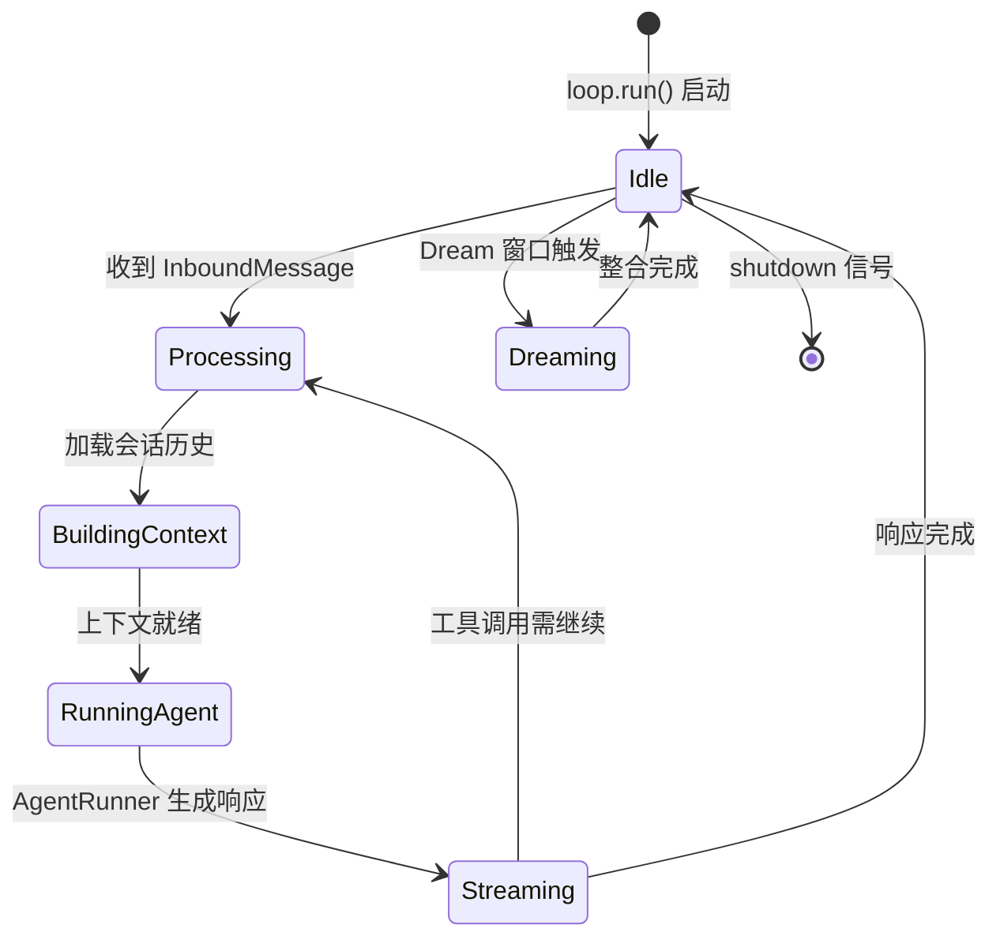
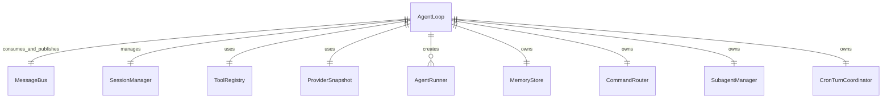

# AgentLoop

AgentLoop 是 nanobot 的核心处理引擎，负责从 MessageBus 消费入站消息、构建对话上下文、协调 AgentRunner 执行 LLM 对话循环，并将响应发布回消息总线。

## 什么是 AgentLoop？

AgentLoop 代表 Agent 的"大脑"——它管理着 MessageBus -> Session -> Context -> LLM -> Tool -> Response 的完整数据流。每个 Gateway 实例运行一个 AgentLoop 实例。

**关键特征**:
- 异步事件循环：通过 `asyncio.Queue` 消费入站消息
- 会话键管理：统一会话键（UNIFIED_SESSION_KEY）确保多渠道消息汇聚到同一会话
- 上下文治理：通过 ContextGovernor 控制上下文大小和块数量
- 钩子系统：支持 Agent 级别和 Turn 级别的生命周期钩子
- Dream 整合：在 Dream 窗口触发时协调记忆整合
- 暂停/恢复：支持工具/技能执行期间的暂停和恢复

## 代码位置

| 方面 | 位置 |
|------|------|
| 核心类 | `nanobot/agent/loop.py`（2040 行） |
| 对话执行 | `nanobot/agent/runner.py`（1505 行） |
| 上下文构建 | `nanobot/agent/context.py` |
| 上下文治理 | `nanobot/agent/context_governance.py` |
| 自动压缩 | `nanobot/agent/autocompact.py` |
| 记忆系统 | `nanobot/agent/memory.py`（1210 行） |
| 会话管理 | `nanobot/session/manager.py`（967 行） |
| 测试 | `tests/agent/`（74 个文件） |

## 结构

```python
class AgentLoop:
    bus: MessageBus                     # 消息总线
    sessions: SessionManager            # 会话管理
    tool_registry: ToolRegistry         # 工具注册表
    provider_snapshot: ProviderSnapshot # LLM 提供商快照
    memory: MemoryStore                 # 记忆存储
    command_router: CommandRouter       # 命令路由器
    subagent_manager: SubagentManager   # 子 Agent 管理
    cron_coordinator: CronTurnCoordinator # Cron 回合协调

    async def run(self) -> None: ...
    async def _process_inbound(self, msg: InboundMessage) -> None: ...
    async def _build_context(self, session, msg) -> ContextSpec: ...
```

## 生命周期



## 关系



| 关联组件 | 关系 | 描述 |
|---------|------|------|
| MessageBus | 消费/发布 | 从 inbound 队列消费消息，向 outbound 队列发布响应 |
| SessionManager | 管理 | 创建、查找、持久化会话，提供历史消息 |
| AgentRunner | 创建 | 每次对话回合创建一个 AgentRunner 实例 |
| MemoryStore | 拥有 | 管理 SOUL.md、USER.md、MEMORY.md 等长期记忆 |

## 不变量

1. **消息幂等性**: 同一 `message_id` 的入站消息不会被重复处理
2. **会话锁定**: 同一会话的并发回合必须串行执行
3. **上下文上限**: 上下文 token 数不超过 provider 的 `context_window_tokens`
4. **Dream 安全**: Dream 运行中的工具错误不会导致 memory cursor 向前推进
