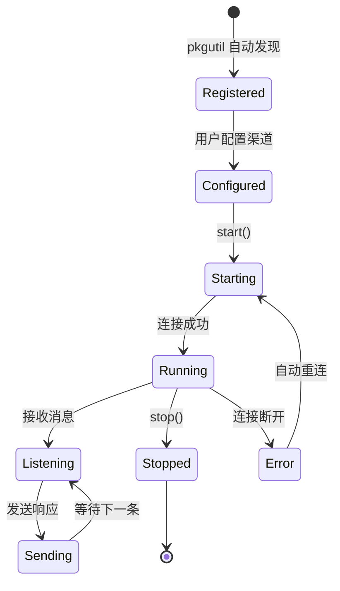
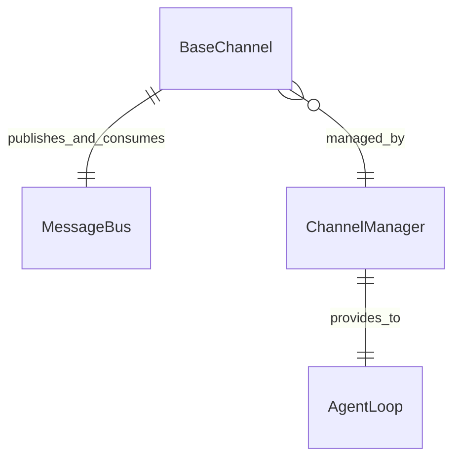

# Channel（聊天渠道）

Channel 是 nanobot 与外部聊天平台的集成层。每个渠道负责将特定平台的消息格式转换为系统内部的 InboundMessage/OutboundMessage，通过 MessageBus 与 Agent 通信。

## 什么是 Channel？

Channel 是连接 nanobot Agent 和外部聊天平台的桥梁。它负责接收用户消息、转换为内部格式、发布到 MessageBus，同时从 MessageBus 消费 Agent 的响应并发送回聊天平台。nanobot 内置支持 17 种聊天渠道。

## 代码位置

| 方面 | 位置 |
|------|------|
| 基类 | `nanobot/channels/base.py`（298 行） |
| 渠道管理 | `nanobot/channels/manager.py` |
| 渠道注册 | `nanobot/channels/registry.py` |
| 各渠道实现 | `nanobot/channels/<name>/runtime.py` |
| 渠道清单 | `nanobot/channels/<name>/manifest.py` |

## 结构

```python
class BaseChannel(ABC):
    name: str                            # 渠道标识
    display_name: str                    # 显示名称

    # 渠道能力标志
    send_progress: bool = True           # 是否发送处理中指示
    send_tool_hints: bool = True         # 是否发送工具调用提示
    show_reasoning: bool = True          # 是否显示推理过程

    async def start(self) -> None: ...   # 启动渠道
    async def stop(self) -> None: ...    # 停止渠道
    async def send(self, recipient, text, **kwargs) -> None: ...
    async def login(self) -> bool: ...   # 认证/登录
```

## 支持的渠道

| 渠道 | 标识 | 类型 |
|------|------|------|
| Telegram | `telegram` | Bot API |
| Discord | `discord` | Bot |
| Slack | `slack` | App |
| 微信 | `weixin` | 个人/公众号 |
| 飞书 | `feishu` | Bot + WebSocket |
| 钉钉 | `dingtalk` | Bot |
| WhatsApp | `whatsapp` | Business API |
| QQ | `qq` | Bot |
| 企业微信 | `wecom` | Bot |
| Matrix | `matrix` | 联邦协议 |
| Signal | `signal` | Bot |
| Email | `email` | SMTP/IMAP |
| MS Teams | `msteams` | Bot |
| Mattermost | `mattermost` | Bot |
| WebSocket | `websocket` | 直连 |
| MoChat | `mochat` | Bot |
| NapCat | `napcat` | QQ 兼容 |

## 渠道目录结构

每个渠道是一个自包含包：

```
nanobot/channels/<name>/
├── __init__.py
├── manifest.py       # 渠道元数据声明
├── runtime.py        # BaseChannel 实现
├── validation.py     # 配置验证（可选）
├── connect.py        # 连接器（部分渠道）
├── webui/            # 渠道专用 WebUI 组件
└── tests/            # 渠道测试
```

## 生命周期



## 关系



| 关联组件 | 关系 | 描述 |
|---------|------|------|
| MessageBus | 发布/消费 | 发布入站消息，消费出站消息 |
| ChannelManager | 被管理 | 统一生命周期管理（start_all/stop_all） |
| AgentLoop | 间接关联 | 通过 MessageBus 解耦，不直接持有引用 |

## 不变量

1. **自包含**: 每个渠道包是独立的功能单元，不依赖其他渠道
2. **自动发现**: ChannelManager 通过 pkgutil 扫描发现所有渠道
3. **配对审批**: 来自未配对发送者的 DM 消息需通过配对码审批
4. **重试机制**: 发送失败时自动重试（指数退避）
