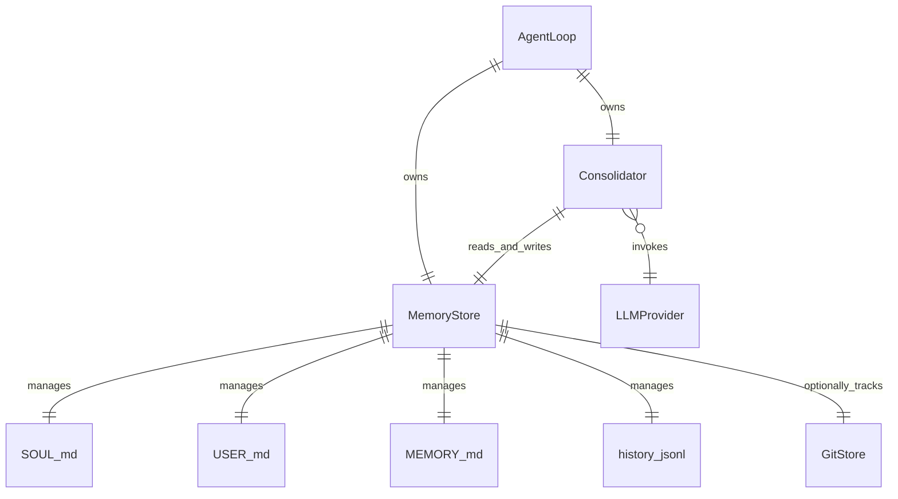

# Memory（记忆系统）

Memory 系统是 nanobot 的长期知识存储层，通过文件 I/O 管理 Agent 的"灵魂"（SOUL.md）、"用户画像"（USER.md）和"知识库"（MEMORY.md）。Dream 整合器在 Agent"睡眠"时反思对话历史，自动更新这些记忆文件。

## 什么是 Memory？

Memory 系统由两部分组成：MemoryStore（纯文件 I/O 层）和 Consolidator（Dream 两阶段记忆整合器）。MemoryStore 使用原子写入 + fsync 管理 workspace 目录下的 Markdown 和 JSONL 文件。Consolidator 在 Dream 窗口触发时调用 LLM 分析最近对话，提取用户偏好、事实知识和行为模式，增量更新记忆文件。

**关键特征**:
- 原子写入：所有文件更新使用 temp + replace 模式
- fsync 持久化：确保数据在崩溃后不丢失
- GitStore 版本化：可选启用 Git 版本控制跟踪记忆变更
- Dream 两阶段：分析阶段（提取关键信息）+ 整合阶段（更新文件）
- 工作区提示覆盖：支持项目级 workspace prompt 文件
- 历史去重：通过 cursor 机制避免重复处理

## 代码位置

| 方面 | 位置 |
|------|------|
| MemoryStore | `nanobot/agent/memory.py`（1210 行） |
| Consolidator | `nanobot/agent/memory.py`（同文件） |
| GitStore | `nanobot/utils/gitstore.py` |
| 提示模板 | `nanobot/templates/memory/` |
| 测试 | `tests/agent/test_memory*.py` |

## 结构

```python
class MemoryStore:
    workspace: Path
    memory_file: Path      # memory/MEMORY.md
    history_file: Path     # memory/history.jsonl
    soul_file: Path        # SOUL.md
    user_file: Path        # USER.md
    _cursor_file: Path     # memory/.cursor
    _dream_cursor_file: Path # memory/.dream_cursor

    async def read_memory(self) -> str: ...
    async def append_to_history(self, entry) -> None: ...
    async def update_soul(self, content) -> None: ...
    async def update_user(self, content) -> None: ...

class Consolidator:
    async def run_dream(self, llm, sessions) -> DreamResult: ...
```

## Dream 流程

```mermaid
sequenceDiagram
    participant Loop as AgentLoop
    participant Cons as Consolidator
    participant LLM as LLMProvider
    participant Store as MemoryStore

    Loop->>Cons: Dream 窗口触发
    Cons->>Store: 读取当前 SOUL.md, USER.md, MEMORY.md
    Cons->>Store: 读取最近对话历史
    Cons->>LLM: 分析对话提取关键信息
    LLM-->>Cons: 识别到的模式和事实
    Cons->>LLM: 生成增量更新（diff）
    LLM-->>Cons: 更新内容
    Cons->>Store: 原子写入更新后的文件
    Cons->>Store: 更新 cursor 位置
    Store-->>Loop: Dream 完成
```

## 关系



| 关联组件 | 关系 | 描述 |
|---------|------|------|
| SOUL.md | 管理 | Agent 的行为准则和人格定义 |
| USER.md | 管理 | 用户的偏好、背景和行为模式 |
| MEMORY.md | 管理 | Agent 学到的知识片段 |
| GitStore | 可选跟踪 | 通过 Git 版本控制记忆文件变更 |
| Consolidator | 读写 | Dream 时读取现有记忆，生成增量更新 |

## 不变量

1. **原子写入**: 文件更新通过 temp 文件 + os.replace() 实现，绝不部分写入
2. **cursor 安全**: Dream 运行中的工具错误不推进 cursor
3. **文件大小上限**: 单文件嵌入 Dream prompt 的内容不超过 8000 字符
4. **历史条目上限**: 默认最多保留 1000 条历史记录
