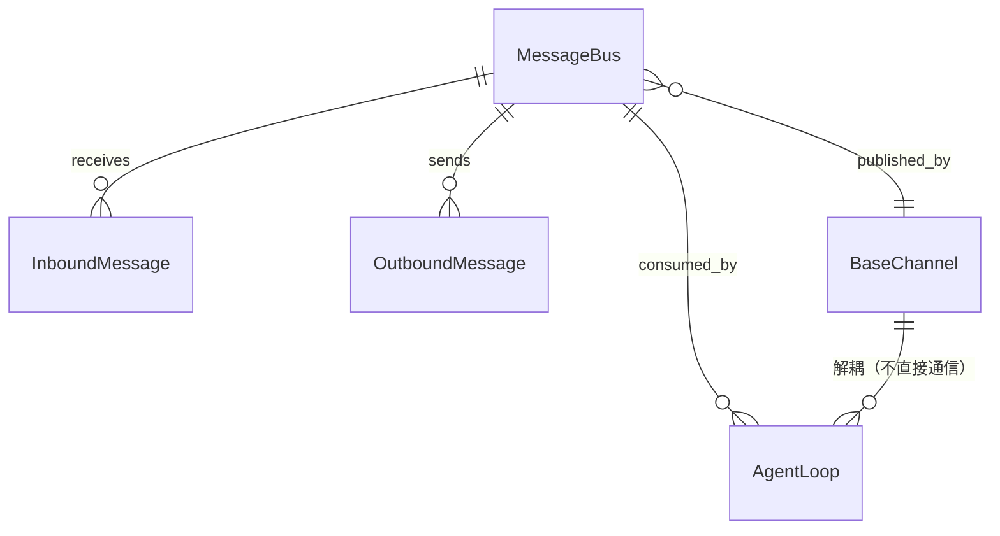

# MessageBus

MessageBus 是 nanobot 中的消息中枢，通过两个独立的 `asyncio.Queue` 实现聊天渠道和 Agent 之间的完全解耦。

## 什么是 MessageBus？

MessageBus 在线程安全的消息队列之上提供了一个简洁的 pub/sub 接口。所有入站消息（来自聊天平台的用户输入）进入 `inbound` 队列，所有出站消息（Agent 的响应）进入 `outbound` 队列。渠道只与消息总线交互，Agent 也只与消息总线交互——两者互不感知。

**关键特征**:
- 两个独立队列：inbound（入站）和 outbound（出站）
- 异步安全：基于 `asyncio.Queue`
- 轻量级：仅 44 行核心代码
- 无持久化：消息总线不负责持久化

## 代码位置

| 方面 | 位置 |
|------|------|
| 核心实现 | `nanobot/bus/queue.py`（44 行） |
| 入站事件类型 | `nanobot/bus/events.py` |
| 出站事件类型 | `nanobot/bus/outbound_events.py` |
| 运行时事件 | `nanobot/bus/runtime_events.py` |
| 进度事件 | `nanobot/bus/progress.py` |
| 测试 | `tests/bus/` |

## 结构

```python
class MessageBus:
    inbound: asyncio.Queue[InboundMessage]
    outbound: asyncio.Queue[OutboundMessage]

    async def publish_inbound(self, msg: InboundMessage) -> None: ...
    async def publish_outbound(self, msg: OutboundMessage) -> None: ...
    async def consume_inbound(self) -> InboundMessage: ...
    async def consume_outbound(self) -> OutboundMessage: ...
```

## 关键数据结构

```python
@dataclass
class InboundMessage:
    id: str              # 唯一消息 ID
    channel: str         # 来源渠道名称
    sender: str          # 发送者标识
    content: str         # 消息文本
    session_key: str     # 目标会话键
    timestamp: datetime
    metadata: dict       # 渠道特定元数据

@dataclass
class OutboundMessage:
    id: str
    channel: str         # 目标渠道名称
    recipient: str       # 接收者标识
    content: str         # 回复文本
    session_key: str
    metadata: dict
```

## 关系



| 关联组件 | 关系 | 描述 |
|---------|------|------|
| BaseChannel | 发布者 | 渠道发布 `InboundMessage` 到 `inbound` 队列 |
| AgentLoop | 消费者 | AgentLoop 从 `inbound` 队列消费消息 |
| AgentLoop | 发布者 | AgentLoop 发布 `OutboundMessage` 到 `outbound` 队列 |
| BaseChannel | 消费者 | 渠道从 `outbound` 队列消费响应 |

## 不变量

1. **解耦保证**: Channel 和 AgentLoop 不持有对方引用，仅通过 MessageBus 通信
2. **顺序保证**: 同一队列内的消息按 FIFO 顺序处理
3. **类型安全**: 所有消息通过 dataclass 类型约束
