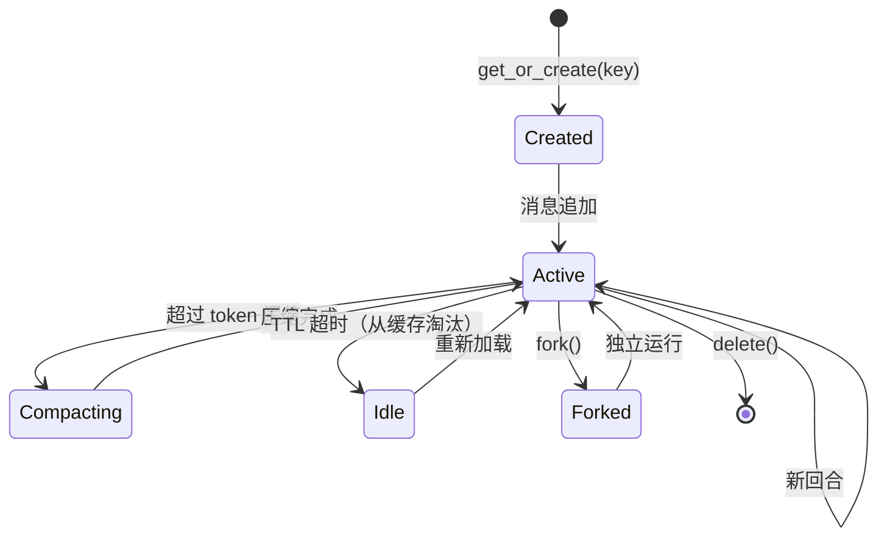
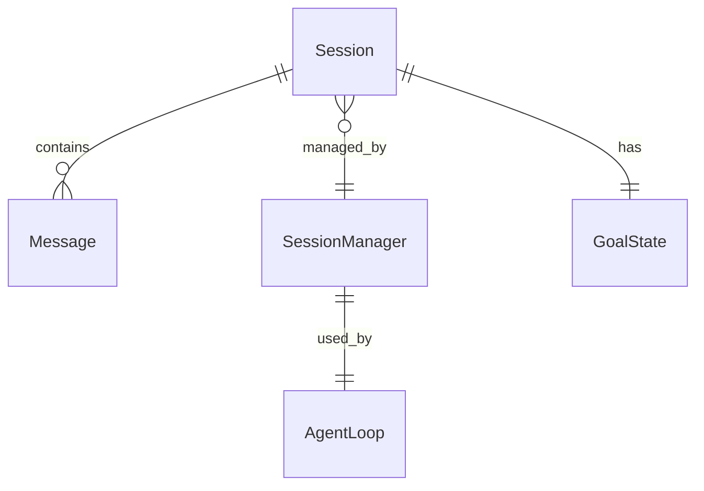

# Session（会话）

Session 是 nanobot 中管理对话历史的核心单元，负责持久化每条对话频道的消息历史、管理上下文窗口和会话生命周期。

## 什么是 Session？

每个 Session 由唯一的 `session_key` 标识，包含完整的消息历史（JSON 格式），存储在磁盘上并通过内存 LRU 缓存加速访问。SessionManager 统一管理所有会话，支持 TTL 自动压缩、上下文重放和会话分叉。

**关键特征**:
- LRU 缓存：128 会话内存缓存，超出后自动淘汰
- 文件持久化：每条消息写入 JSONL 文件
- 自动压缩：超过 token 阈值时自动压缩早期消息
- 上下文重放：按 context_window_tokens 计算最大重放消息数
- 分叉支持：可从一个会话分支出独立副本
- 持续性目标：跨会话的长期目标状态跟踪

## 代码位置

| 方面 | 位置 |
|------|------|
| 核心类 | `nanobot/session/manager.py`（967 行） |
| 会话键 | `nanobot/session/keys.py` |
| 目标状态 | `nanobot/session/goal_state.py` |
| 历史可见性 | `nanobot/session/history_visibility.py` |
| 模型选择 | `nanobot/session/model_selection.py` |
| 测试 | `tests/session/`（7 个文件） |

## 结构

```python
@dataclass
class Session:
    key: str                           # 唯一会话键
    messages: list[dict]               # 消息历史
    metadata: dict                     # 元数据（标题、目标状态等）
    created_at: datetime
    updated_at: datetime

class SessionManager:
    _cache: OrderedDict[str, Session]  # LRU 缓存（128 上限）
    _data_dir: Path                    # 持久化目录

    async def get_or_create(self, key) -> Session: ...
    async def save(self, session) -> None: ...
    async def compact(self, session) -> Session: ...
    async def fork(self, session) -> Session: ...
    def replay_max_messages_for_context(self, ctx_window) -> int: ...
```

## 生命周期



## 关系



| 关联组件 | 关系 | 描述 |
|---------|------|------|
| Message | 包含 | 每个 Session 包含有序的消息列表 |
| SessionManager | 管理 | 缓存的 LRU 淘汰和持久化 |
| GoalState | 持有 | 跨会话的长期任务状态 |
| AgentLoop | 使用 | 加载历史构建 LLM 上下文 |

## 不变量

1. **单写原则**: 同一会话的并发写入必须串行化
2. **缓存上限**: 内存中同时最多缓存 128 个活跃会话
3. **文件上限**: 单个会话最多存储 2000 条消息
4. **压缩安全**: 压缩后的消息总数不少于 `MIN_REPLAY_MAX_MESSAGES`（120）
